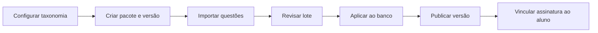
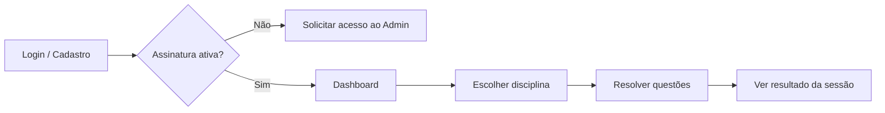

# SimulaPro Concursos — Visão Geral

Documento oficial de visão do projeto. Descreve o propósito, os perfis de usuário, os fluxos principais, o escopo do MVP e a estrutura geral da plataforma.

---

## Frase guia

> **Admin produz e publica conteúdo. Aluno apenas estuda o conteúdo comprado.**

Esta frase orienta todas as decisões de produto e arquitetura:

- O **Admin** é responsável por cadastrar a taxonomia, importar questões, montar pacotes, publicar versões e liberar acesso aos alunos.
- O **Aluno** não cria, edita nem importa conteúdo. Ele consome exclusivamente o material vinculado à sua assinatura ativa.

---


## 1. Objetivo do projeto

O **SimulaPro Concursos** é uma plataforma profissional de preparação para concursos públicos. O objetivo é oferecer um ambiente estruturado em que estudantes resolvam questões reais organizadas por **curso**, **cargo**, **banca**, **disciplina** e **assunto**, com curadoria contínua feita pela equipe administrativa.

A plataforma resolve três necessidades centrais:


| Necessidade         | Como o SimulaPro atende                                                       |
| ------------------- | ----------------------------------------------------------------------------- |
| Conteúdo organizado | Taxonomia hierárquica (curso → cargo, banca → concurso, disciplina → assunto) |
| Estudo direcionado  | O aluno escolhe uma disciplina e resolve questões do pacote publicado         |
| Acompanhamento      | Registro de tentativas, estatísticas e histórico de desempenho                |


O produto é dividido em **dois portais independentes**: o painel administrativo (`/admin`) e a área do aluno (`/app`), ambos integrados ao mesmo backend (Supabase / Lovable Cloud).

---


## 2. Perfis existentes

O sistema reconhece exatamente **dois perfis**, definidos pelo enum `app_role` no banco de dados:


| Perfil            | Valor técnico | Descrição                                                                                                       |
| ----------------- | ------------- | --------------------------------------------------------------------------------------------------------------- |
| **Administrador** | `admin`       | Produz, organiza, importa e publica conteúdo. Gerencia usuários e assinaturas. Acesso total ao painel `/admin`. |
| **Aluno**         | `student`     | Estuda o conteúdo liberado pela assinatura. Acesso à área `/app`.                                               |


### Regras de atribuição

- Todo novo usuário cadastrado recebe automaticamente o perfil **Aluno** (trigger `handle_new_user`).
- O perfil **Admin** é atribuído manualmente pela equipe (tabela `user_roles`).
- Não existem outros perfis (sem professor, revisor ou moderador).
- Após o login, o redirecionamento é automático: Admin → `/admin`, Aluno → `/app`.


### Permissões (resumo)


| Recurso                             | Admin             | Aluno                                 |
| ----------------------------------- | ----------------- | ------------------------------------- |
| Taxonomia e questões                | Leitura e escrita | Somente leitura do conteúdo publicado |
| Importação e publicação             | Total             | Sem acesso                            |
| Assinaturas                         | Criar e gerenciar | Ver apenas a própria                  |
| Tentativas, favoritos, estatísticas | Ver todos         | Apenas os próprios                    |


---


## 3. Fluxo do Admin

O administrador segue um ciclo de **produção → revisão → publicação → liberação de acesso**.




### Etapas detalhadas


#### 3.1 Configurar a taxonomia de conteúdo

O Admin cadastra a estrutura base que classifica as questões:

- **Cursos** — ex.: Polícia Federal, Tribunais
- **Cargos** — vinculados a um curso
- **Bancas** — ex.: CESPE, FCC, FGV
- **Concursos** — vinculados a uma banca
- **Disciplinas** — ex.: Direito Constitucional, Português
- **Assuntos** — vinculados a uma disciplina


#### 3.2 Montar pacotes e versões

- **Pacotes** agrupam conjuntos de questões para um curso.
- **Versões** representam releases do pacote (ex.: `v1.0`, `v1.1`).
- Apenas **uma versão por pacote** pode estar publicada por vez; ao publicar uma nova, as anteriores são despublicadas automaticamente.


#### 3.3 Importar questões

O Admin **não cadastra questões manualmente** (não há botão "Nova Questão"). O fluxo oficial é:

1. Selecionar curso, pacote e versão de destino.
2. Enviar arquivo **CSV, XLSX ou JSON** com as questões.
3. O sistema valida o arquivo (enunciado, alternativas, gabarito, disciplina, duplicatas).
4. Salvar o lote em **staging** (`import_batches`, status `pending`).
5. Revisar o relatório de validação.
6. **Aplicar** o lote — as questões são inseridas no banco e a taxonomia é criada automaticamente quando necessário.


#### 3.4 Publicar conteúdo

Na tela de **Versões**, o Admin publica a versão desejada. A partir desse momento:

- Os alunos com assinatura ativa naquele pacote passam a ver o conteúdo da versão publicada.
- O dashboard do Admin exibe métricas de questões publicadas e em revisão.


#### 3.5 Gerenciar usuários e assinaturas

- **Usuários** — lista de perfis cadastrados (Admin e Aluno).
- **Assinaturas** — vincula um aluno a um **curso** e a um **pacote**. Sem assinatura ativa, o aluno não acessa conteúdo de estudo.


#### 3.6 Monitorar o sistema

O **Dashboard** do Admin consolida contagens de cursos, pacotes, versões, questões, usuários, assinaturas ativas, última importação e última publicação.

### Rotas do portal Admin


| Rota                   | Função                                                 |
| ---------------------- | ------------------------------------------------------ |
| `/admin`               | Dashboard                                              |
| `/admin/courses`       | CRUD de cursos                                         |
| `/admin/positions`     | CRUD de cargos                                         |
| `/admin/boards`        | CRUD de bancas                                         |
| `/admin/exams`         | CRUD de concursos                                      |
| `/admin/subjects`      | CRUD de disciplinas                                    |
| `/admin/topics`        | CRUD de assuntos                                       |
| `/admin/questions`     | Listar, filtrar e editar questões (sem criação manual) |
| `/admin/import`        | Wizard de importação                                   |
| `/admin/export`        | Exportar dados                                         |
| `/admin/packages`      | CRUD de pacotes                                        |
| `/admin/versions`      | CRUD e publicação de versões                           |
| `/admin/users`         | Lista de usuários                                      |
| `/admin/subscriptions` | CRUD de assinaturas                                    |


---


## 4. Fluxo do Aluno

O aluno segue um ciclo simples de **acesso → estudo → acompanhamento**.




### Etapas detalhadas


#### 4.1 Autenticação

- O aluno acessa `/auth` para login ou cadastro (e-mail e senha).
- Novos cadastros recebem perfil **Aluno** automaticamente.


#### 4.2 Dashboard

Na área `/app`, o aluno visualiza:

- Curso e pacote da assinatura ativa
- Versão publicada do pacote
- Quantidade de disciplinas e questões disponíveis
- Questões já respondidas e última atividade

Se não houver assinatura ativa, é exibida uma mensagem orientando o aluno a falar com o administrador.

#### 4.3 Estudo

Na rota `/app/study`, o aluno:

1. Seleciona uma **disciplina** (entre as disponíveis na versão publicada do seu pacote).
2. Define a **quantidade de questões** da sessão (5, 10, 20, 30, 50 ou 100).
3. Resolve as questões uma a uma, com feedback imediato (correta/incorreta).
4. Consulta explicação, comentários das alternativas, bibliografia e referência legal quando disponíveis.
5. Ao final, vê o **resultado da sessão** (acertos, erros e percentual).

Cada resposta é registrada em `question_attempts` para histórico e estatísticas.

### Rotas do portal Aluno (MVP atual)


| Rota         | Função                             |
| ------------ | ---------------------------------- |
| `/app`       | Dashboard com resumo da assinatura |
| `/app/study` | Sessão de estudo por disciplina    |


> Rotas planejadas para etapas futuras: histórico (`/app/history`), favoritos (`/app/favorites`), estatísticas (`/app/stats`), perfil e configurações.

---


## 5. Escopo do MVP


### Dentro do escopo


| Área              | O que está incluído                                                        |
| ----------------- | -------------------------------------------------------------------------- |
| **Autenticação**  | Login, cadastro e redirecionamento por perfil                              |
| **Taxonomia**     | CRUD completo de cursos, cargos, bancas, concursos, disciplinas e assuntos |
| **Questões**      | Importação em lote (CSV/XLSX/JSON), validação, staging e aplicação         |
| **Pacotes**       | Criação de pacotes, versões e publicação (uma versão ativa por pacote)     |
| **Assinaturas**   | Vínculo aluno ↔ curso ↔ pacote                                             |
| **Estudo**        | Seleção de disciplina, sessão de questões com correção e resultado         |
| **Histórico**     | Registro de tentativas por questão (`question_attempts`)                   |
| **Administração** | Dashboard, listagem de usuários, exportação de dados                       |
| **Segurança**     | RLS no Supabase, roles `admin`/`student`, função `has_role`                |
| **Design**        | Interface premium com Shadcn UI, responsiva, tokens semânticos             |


### Fora do escopo (MVP)


| Item                                    | Motivo                                              |
| --------------------------------------- | --------------------------------------------------- |
| IA generativa                           | Não faz parte da proposta inicial                   |
| Cadastro manual de questões             | Conteúdo entra exclusivamente por importação        |
| Pagamento / checkout                    | Assinaturas são gerenciadas manualmente pelo Admin  |
| Simulados personalizados                | Aluno estuda por disciplina, sem montagem de provas |
| Meta diária, cronômetro, tempo estimado | Simplificação intencional do fluxo de estudo        |
| Perfis extras (professor, revisor)      | Apenas Admin e Aluno                                |
| Favoritos e estatísticas avançadas (UI) | Schema pronto; telas do aluno em etapa futura       |
| Logs e configurações (UI Admin)         | Planejados; não bloqueiam o MVP                     |


---


## 6. Estrutura geral da plataforma


### Arquitetura de alto nível

```
┌─────────────────────────────────────────────────────────┐
│                    SimulaPro Concursos                   │
├──────────────────────┬──────────────────────────────────┤
│   Portal Admin       │         Portal Aluno              │
│   /admin/*           │         /app/*                    │
├──────────────────────┴──────────────────────────────────┤
│              Frontend (TanStack Start + React)           │
│              UI: Shadcn · Estado: TanStack Query         │
├─────────────────────────────────────────────────────────┤
│              Backend (Supabase / Lovable Cloud)          │
│              Auth · PostgreSQL · RLS · Storage           │
└─────────────────────────────────────────────────────────┘
```


### Stack tecnológica


| Camada          | Tecnologia                             |
| --------------- | -------------------------------------- |
| Framework       | TanStack Start (roteamento file-based) |
| UI              | React 19, Shadcn UI, Tailwind CSS      |
| Estado servidor | TanStack Query                         |
| Backend         | Supabase (Auth, PostgreSQL, RLS)       |
| Linguagem       | TypeScript                             |


### Modelo de dados (entidades principais)

```
Taxonomia                Conteúdo                 Acesso
─────────                ────────                 ──────
courses                  packages                 profiles
positions                package_versions         user_roles
boards                   questions                subscriptions
exams                    import_batches
subjects                 logs
topics

Aluno (dados próprios)
──────────────────────
question_attempts
favorites
statistics
```


### Relação entre entidades-chave

- Um **pacote** pertence opcionalmente a um **curso**.
- Uma **versão** pertence a um **pacote** e pode estar **publicada** ou não.
- As **questões** pertencem a uma **versão** e são classificadas pela taxonomia.
- Uma **assinatura** liga um **aluno** a um **curso** e a um **pacote**.
- O aluno estuda apenas questões da **versão publicada** do pacote da sua assinatura.


### Páginas públicas


| Rota    | Função                                   |
| ------- | ---------------------------------------- |
| `/`     | Landing page com apresentação do produto |
| `/auth` | Login e cadastro                         |


---


## Resumo

O SimulaPro Concursos é uma plataforma de dois portais — **Admin** e **Aluno** — construída sobre Supabase. O Admin monta a taxonomia, importa questões em lote, organiza pacotes versionados e publica o conteúdo; em seguida, libera o acesso via assinaturas. O Aluno entra na área de estudo, escolhe uma disciplina e resolve questões do material que adquiriu, sem qualquer capacidade de produzir ou alterar conteúdo.

A frase guia resume a divisão de responsabilidades:

> **Admin produz e publica conteúdo. Aluno apenas estuda o conteúdo comprado.**

