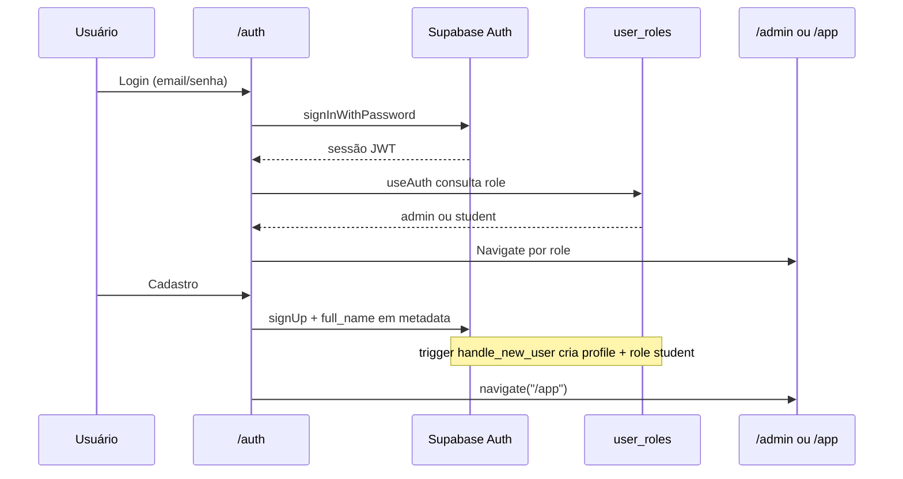
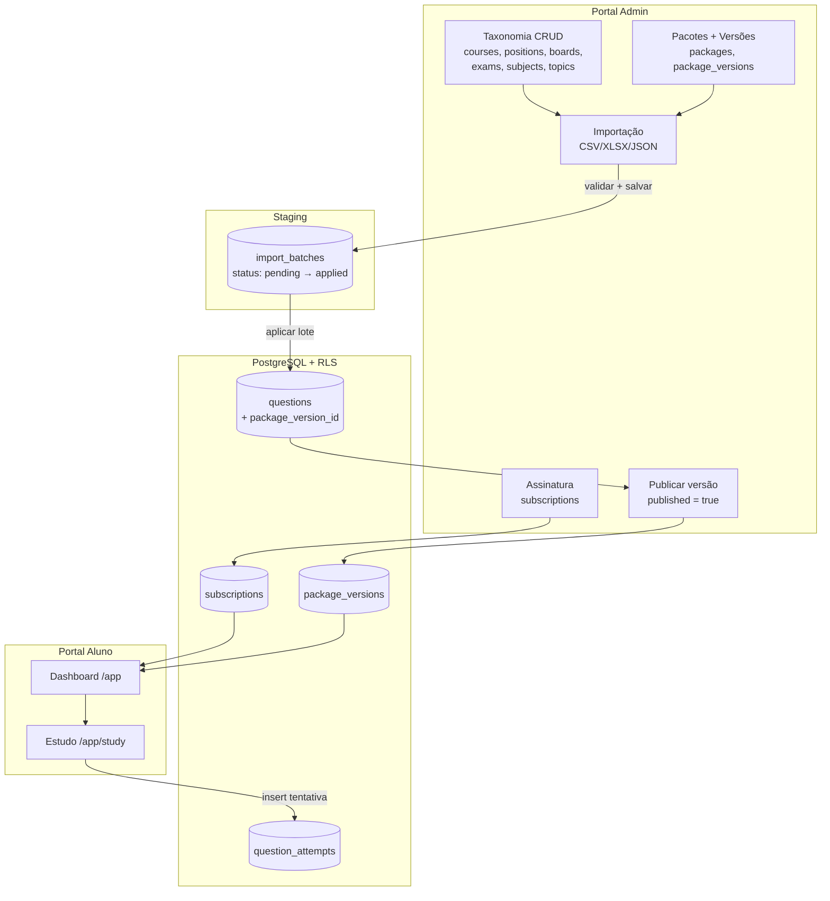

# SimulaPro Concursos — Arquitetura

Documentação técnica da arquitetura **como implementada no código atual**. Para visão de produto, ver [`00-VISAO-GERAL.md`](./00-VISAO-GERAL.md). Para regras de trabalho, ver [`CURSOR_RULES.md`](./CURSOR_RULES.md).

---

## Arquitetura Geral

### Visão em alto nível

O SimulaPro é uma aplicação **full-stack** com frontend em TanStack Start (React) e backend em Supabase (PostgreSQL + Auth + RLS). A lógica de negócio roda predominantemente no **cliente**: as páginas consultam e alteram dados via `@supabase/supabase-js` diretamente, com TanStack Query para cache e mutations.

```
┌──────────────────────────────────────────────────────────────────┐
│                         Navegador                                 │
│  TanStack Router · React 19 · Shadcn UI · TanStack Query         │
├────────────────────────────┬─────────────────────────────────────┤
│     Portal Admin (/admin)  │        Portal Aluno (/app)          │
├────────────────────────────┴─────────────────────────────────────┤
│              supabase (client) — src/integrations/supabase/       │
├──────────────────────────────────────────────────────────────────┤
│                    Supabase (Lovable Cloud)                       │
│         Auth · PostgreSQL · RLS · triggers · functions            │
└──────────────────────────────────────────────────────────────────┘

Servidor TanStack Start (SSR):
  src/server.ts → wrapper de erros SSR
  src/start.ts  → middleware attachSupabaseAuth (para serverFn futuras)
```

O entry point do servidor customizado está em `src/server.ts`, referenciado em `vite.config.ts` (`tanstackStart.server.entry: "server"`).

---

### Separação entre Portal Admin e Portal Aluno

Os dois portais compartilham o mesmo `AppShell` (`src/components/AppShell.tsx`), mas com configurações distintas:

| Aspecto | Portal Admin | Portal Aluno |
|---------|--------------|--------------|
| Rota base | `/admin` | `/app` |
| Layout | `src/routes/_authenticated/admin/route.tsx` | `src/routes/_authenticated/app/route.tsx` |
| Brand | `"SimulaPro Admin"` | `"SimulaPro"` |
| `requireRole` | `"admin"` (passado, mas não aplicado — ver auditoria) | não definido |
| Menu lateral | 4 grupos: Geral, Conteúdo, Dados, Gestão | 1 grupo: Meu Estudo |
| Páginas | 14 rotas admin | 2 rotas aluno |

Ambos os portais ficam sob o layout pai `/_authenticated`, que atualmente apenas renderiza `<Outlet />` sem gate de login.

---

### Fluxo de autenticação

**Implementação atual** (`src/routes/auth.tsx`, `src/hooks/use-auth.ts`, `src/routes/__root.tsx`):



Detalhes observados no código:

1. **Login** — `supabase.auth.signInWithPassword` em `/auth`. Se já autenticado com role, redireciona: `admin` → `/admin`, demais → `/app`.
2. **Cadastro** — `supabase.auth.signUp` com `full_name` em `raw_user_meta_data`. Após sucesso, navega para `/app` (não aguarda confirmação de e-mail no fluxo da UI).
3. **Sessão** — `useAuth` escuta `onAuthStateChange` e carrega sessão inicial com `getSession`.
4. **Persistência** — client Supabase usa `localStorage`, `persistSession: true`, `autoRefreshToken: true` (`client.ts`).
5. **Invalidação** — `__root.tsx` invalida router e queries em `SIGNED_IN`, `SIGNED_OUT`, `USER_UPDATED`.
6. **Logout** — `AppShell.handleLogout`: cancela queries, limpa cache, `signOut`, navega para `/auth`.

**Estado temporário:** `/_authenticated/route.tsx` e `AppShell.tsx` contêm comentários `TEMPORÁRIO: acesso liberado sem login` — as rotas `/admin` e `/app` são acessíveis sem autenticação obrigatória.

---

### Fluxo de autorização (roles)

**Banco de dados** (`supabase/migrations/20260702152648_*.sql`):

- Enum `app_role`: `'admin' | 'student'`
- Tabela `user_roles` com `UNIQUE (user_id, role)`
- Função `has_role(_user_id, _role)` — `SECURITY DEFINER`
- Trigger `handle_new_user`: novo usuário recebe `profiles` + role `student`
- RLS em `user_roles`: usuário lê próprio role; admin gerencia todos

**Frontend** (`src/hooks/use-auth.ts`):

- Consulta `user_roles` filtrando por `user_id`
- Se algum registro tem `role === "admin"` → `role = "admin"`
- Caso contrário → `role = "student"`
- Retorna `{ session, user, role, loading }`

**RLS nas tabelas de conteúdo** (mesma migration):

- Tabelas de taxonomia/conteúdo: `SELECT` para `authenticated`; escrita apenas com `has_role(auth.uid(), 'admin')`
- `import_batches`, `logs`: somente admin
- `subscriptions`: aluno lê própria; admin escreve
- `question_attempts`, `favorites`, `statistics`: dados próprios do usuário

**Autorização no client:** `AppShell` recebe `requireRole="admin"` no layout admin, mas as verificações estão desativadas (`void role; void requireRole`). Não há redirect de aluno tentando acessar `/admin`.

**Infraestrutura server-side (não utilizada nas rotas atuais):**

- `requireSupabaseAuth` — middleware para server functions (`auth-middleware.ts`)
- `supabaseAdmin` — client com service role, bypassa RLS (`client.server.ts`)
- `attachSupabaseAuth` — middleware client que anexa Bearer token a serverFn (`auth-attacher.ts`, registrado em `start.ts`)

Nenhum arquivo de rota ou componente importa `requireSupabaseAuth` ou `supabaseAdmin` hoje.

---

### Estrutura de rotas

Roteamento **file-based** do TanStack Router. Árvore gerada em `src/routeTree.gen.ts` (auto-gerado, não editar).

```
__root.tsx
├── /                    index.tsx          (landing)
├── /auth                auth.tsx           (login/cadastro)
└── /_authenticated      route.tsx          (layout pai, ssr: false)
    ├── /admin           admin/route.tsx    (AppShell admin)
    │   ├── /            admin/index.tsx    (dashboard)
    │   ├── /courses     admin/courses.tsx
    │   ├── /positions   admin/positions.tsx
    │   ├── /boards      admin/boards.tsx
    │   ├── /exams       admin/exams.tsx
    │   ├── /subjects    admin/subjects.tsx
    │   ├── /topics      admin/topics.tsx
    │   ├── /questions   admin/questions.tsx
    │   ├── /import      admin/import.tsx
    │   ├── /export      admin/export.tsx
    │   ├── /packages    admin/packages.tsx
    │   ├── /versions    admin/versions.tsx
    │   ├── /users       admin/users.tsx
    │   └── /subscriptions admin/subscriptions.tsx
    └── /app             app/route.tsx      (AppShell aluno)
        ├── /            app/index.tsx      (dashboard)
        └── /study       app/study.tsx      (sessão de estudo)
```

| URL pública | Arquivo | SSR |
|-------------|---------|-----|
| `/` | `routes/index.tsx` | padrão root |
| `/auth` | `routes/auth.tsx` | padrão root |
| `/admin/*`, `/app/*` | `routes/_authenticated/**` | `ssr: false` no layout `_authenticated` |

A landing (`/`) linka diretamente para `/app` e `/admin` sem passar por `/auth`.

---

### Organização das pastas

```
SimulaPro Core/
├── docs/                          # Documentação do projeto
├── supabase/
│   ├── config.toml
│   └── migrations/                # 3 migrations SQL
├── src/
│   ├── routes/                    # Páginas (TanStack file-based routing)
│   │   ├── __root.tsx             # Shell HTML, QueryClient, Toaster
│   │   ├── index.tsx              # Landing
│   │   ├── auth.tsx
│   │   └── _authenticated/
│   │       ├── route.tsx
│   │       ├── admin/             # 14 páginas admin
│   │       └── app/               # 2 páginas aluno
│   ├── components/
│   │   ├── AppShell.tsx           # Layout com sidebar (ambos portais)
│   │   ├── admin/
│   │   │   └── CrudPage.tsx       # CRUD genérico reutilizável
│   │   └── ui/                    # ~40 componentes Shadcn
│   ├── hooks/
│   │   ├── use-auth.ts            # Sessão e role
│   │   └── use-mobile.tsx         # Breakpoint mobile (768px)
│   ├── integrations/supabase/
│   │   ├── client.ts              # Client browser/SSR (publishable key)
│   │   ├── client.server.ts       # Client service role (server only)
│   │   ├── auth-middleware.ts     # requireSupabaseAuth
│   │   ├── auth-attacher.ts       # Bearer token em serverFn
│   │   └── types.ts               # Tipos gerados do schema
│   ├── config/
│   │   └── study.ts               # STUDY_QUANTITIES
│   ├── lib/
│   │   ├── utils.ts               # cn() — clsx + tailwind-merge
│   │   ├── log.ts                 # logEvent → tabela logs
│   │   ├── error-page.ts
│   │   ├── error-capture.ts
│   │   └── lovable-error-reporting.ts
│   ├── styles.css                 # Tokens de tema (Tailwind v4)
│   ├── router.tsx                 # createRouter + QueryClient
│   ├── routeTree.gen.ts           # Árvore de rotas (gerado)
│   ├── start.ts                   # TanStack Start instance
│   └── server.ts                  # Entry SSR com tratamento de erro
├── vite.config.ts
├── components.json                # Config Shadcn
└── package.json
```

**Não existe** pasta `src/services/` no projeto atual.

---

### Stack utilizada

| Camada | Tecnologia | Versão (package.json) |
|--------|------------|------------------------|
| Runtime | Bun (lockfile `bun.lock`) | — |
| Framework | TanStack Start + TanStack Router | ^1.168–1.170 |
| UI | React | ^19.2.0 |
| Estilo | Tailwind CSS v4 + tokens em `styles.css` | ^4.2.1 |
| Componentes | Shadcn UI (estilo `new-york`) + Radix | diversos |
| Ícones | lucide-react | ^0.575.0 |
| Estado servidor | TanStack Query | ^5.101.1 |
| Backend | Supabase JS | ^2.110.0 |
| Planilhas | xlsx | ^0.18.5 |
| Validação | zod (dependência; uso limitado nas rotas) | ^3.24.2 |
| Build | Vite 8 + Nitro (via `@lovable.dev/vite-tanstack-config`) | ^8.0.16 |
| Linguagem | TypeScript | ^5.8.3 |

Scripts disponíveis: `dev`, `build`, `build:dev`, `preview`, `lint`, `format`.

Variáveis de ambiente Supabase (client): `VITE_SUPABASE_URL`, `VITE_SUPABASE_PUBLISHABLE_KEY` (fallback SSR: `SUPABASE_URL`, `SUPABASE_PUBLISHABLE_KEY`). Server admin: `SUPABASE_SERVICE_ROLE_KEY`.

---

### Comunicação com Supabase

#### Cliente principal (`src/integrations/supabase/client.ts`)

- `createClient<Database>` com tipagem de `types.ts`
- Proxy lazy para inicialização tardia
- Custom `fetch` que seta header `apikey` (compatível com novas API keys `sb_publishable_*`)
- Usado em **todas** as páginas, hooks e `log.ts`

#### Padrão de acesso aos dados

Não há camada de services. O padrão é:

```typescript
// Leitura — useQuery
const { data } = useQuery({
  queryKey: ["nome-descritivo", id],
  queryFn: async () => (await supabase.from("tabela").select("...")).data,
});

// Escrita — useMutation
const mutation = useMutation({
  mutationFn: async (payload) => {
    const { error } = await supabase.from("tabela").insert(payload);
    if (error) throw error;
  },
});
```

#### Cliente server (`client.server.ts`)

- Service role, bypassa RLS
- Documentado para uso apenas em handlers server-side
- **Não referenciado** por nenhuma rota ou componente no código atual

#### Middleware de auth

| Arquivo | Função | Uso atual |
|---------|--------|-----------|
| `auth-attacher.ts` | Anexa JWT do client em serverFn | Registrado globalmente em `start.ts` |
| `auth-middleware.ts` | Valida Bearer token no server | **Não usado** em nenhuma serverFn |

#### Auditoria (`log.ts`)

`logEvent(action, entity, entity_id, metadata)` insere em `logs` via client. Usado em `import.tsx`, `versions.tsx`, `questions.tsx`. Erros são silenciados para não interromper o fluxo.

---

### Organização dos componentes

| Pasta | Conteúdo | Papel |
|-------|----------|-------|
| `components/AppShell.tsx` | Layout com Sidebar Shadcn | Shell compartilhado Admin/Aluno |
| `components/admin/CrudPage.tsx` | Tabela + Dialog CRUD genérico | 7 páginas admin de taxonomia/pacotes/assinaturas |
| `components/ui/*` | Botões, tabelas, dialogs, sidebar, etc. | Design system Shadcn |

**Páginas com lógica própria** (não usam `CrudPage`):

| Arquivo | Motivo |
|---------|--------|
| `admin/index.tsx` | Dashboard com métricas agregadas |
| `admin/questions.tsx` | Listagem com filtros + edição inline |
| `admin/import.tsx` | Wizard completo de importação |
| `admin/export.tsx` | Exportação por tabela/formato |
| `admin/versions.tsx` | CRUD + publicação de versões |
| `admin/users.tsx` | Listagem somente leitura com roles |
| `app/index.tsx` | Dashboard do aluno |
| `app/study.tsx` | Máquina de estados da sessão de questões |

`CrudPage` exporta também `useSelectOptions(table)` para popular selects de FK.

---

### Organização dos hooks

| Hook | Arquivo | Função |
|------|---------|--------|
| `useAuth` | `hooks/use-auth.ts` | Sessão Supabase, usuário e role (`admin`/`student`) |
| `useIsMobile` | `hooks/use-mobile.tsx` | Detecta viewport &lt; 768px (usado pelo Shadcn Sidebar) |

Não há hooks dedicados a queries de domínio (estudo, importação, etc.) — as queries ficam inline nas páginas.

---

### Organização dos services

**Não existe camada `services/` no projeto.**

Responsabilidades equivalentes estão distribuídas em:

| Responsabilidade | Onde está |
|------------------|-----------|
| Acesso ao banco | Chamadas `supabase.from()` nas rotas e em `CrudPage` |
| Autenticação | `use-auth.ts` + `auth.tsx` |
| Auditoria | `lib/log.ts` |
| Utilitários UI | `lib/utils.ts` (`cn`) |
| Config de estudo | `config/study.ts` |
| Tipos do schema | `integrations/supabase/types.ts` |
| Lógica de importação | Funções locais em `admin/import.tsx` (`readFile`, `validateFile`, `mapRow`, `apply`) |

---

### Organização das configurações

| Arquivo | Conteúdo |
|---------|----------|
| `src/config/study.ts` | `STUDY_QUANTITIES = [5, 10, 20, 30, 50, 100]` |
| `components.json` | Aliases Shadcn (`@/components`, `@/lib`, `@/hooks`), estilo `new-york`, CSS em `src/styles.css` |
| `vite.config.ts` | `defineConfig` do Lovable com entry server customizado |
| `supabase/config.toml` | Config local do Supabase CLI |
| `.env` | Variáveis Supabase (não versionado) |
| `src/styles.css` | Tokens de cor/tema (oklch), variáveis CSS semânticas |

---

### Fluxo completo dos dados

Fluxo principal de conteúdo, do cadastro à resposta do aluno:



#### Etapas detalhadas (como no código)

1. **Taxonomia** — Admin cadastra via `CrudPage` nas tabelas `courses`, `positions`, `boards`, `exams`, `subjects`, `topics`.

2. **Pacotes** — `packages` (com `course_id` opcional, migration `20260702161516`) e `package_versions` (campo `published` boolean).

3. **Importação** (`admin/import.tsx`):
   - Seleciona curso → pacote (`course_id`) → versão
   - Lê arquivo CSV/XLSX/JSON
   - Valida campos e duplicatas (arquivo + banco)
   - Salva lote em `import_batches` com `status: "pending"` e relatório em `report` JSONB
   - Admin aplica lote: cria taxonomia ausente via `resolveByName`, insere em `questions` com `package_id` e `package_version_id`
   - Atualiza lote para `status: "applied"` (ou `"cancelled"`)

4. **Publicação** (`admin/versions.tsx`):
   - `UPDATE package_versions SET published = true`
   - Trigger `enforce_single_published_version` despublica outras versões do mesmo pacote

5. **Assinatura** — Admin vincula `user_id` + `course_id` + `package_id` em `subscriptions` (`active` default `true`).

6. **Aluno — Dashboard** (`app/index.tsx`):
   - Busca assinatura ativa com joins em `courses`, `packages`
   - Busca versão publicada do pacote
   - Agrega disciplinas e total de questões da versão
   - Conta `question_attempts` do usuário

7. **Aluno — Estudo** (`app/study.tsx`):
   - Resolve `package_id` da assinatura → versão publicada
   - Lista disciplinas presentes nas questões da versão
   - Carrega N questões por `subject_id`, embaralha
   - Ao responder: `insert` em `question_attempts` com `chosen_answer` e `is_correct`
   - Exibe resultado da sessão (acertos/erros/percentual)

#### Tabelas no schema sem uso na UI atual

| Tabela | Existe no banco/types | Usada no frontend |
|--------|----------------------|-------------------|
| `favorites` | Sim | Não |
| `statistics` | Sim | Não |
| `logs` | Sim | Apenas escrita via `logEvent` (sem tela de leitura) |

---

## Pontos que precisam de auditoria

Itens encontrados no código que merecem conferência futura. **Sem proposta de alteração** — apenas registro.

### Autenticação e autorização

| # | Observação | Onde |
|---|------------|------|
| 1 | Acesso a `/admin` e `/app` liberado sem login obrigatório | `_authenticated/route.tsx`, `AppShell.tsx` (comentários `TEMPORÁRIO`) |
| 2 | `requireRole="admin"` passado mas não aplicado; variáveis `void`ed | `AppShell.tsx` |
| 3 | Landing linka direto para `/admin` e `/app`, sem `/auth` | `routes/index.tsx` |
| 4 | `requireSupabaseAuth` existe mas não é usado em nenhuma rota/serverFn | `auth-middleware.ts` |
| 5 | `supabaseAdmin` (service role) existe mas não é importado em lugar nenhum | `client.server.ts` |
| 6 | Cadastro navega para `/app` sem aguardar role carregar ou confirmação de e-mail | `auth.tsx` |
| 7 | Aluno sem role `admin` na tabela ainda recebe `student` por fallback no hook — usuário sem `user_roles` também vira `student` | `use-auth.ts` |

### Rotas e funcionalidades ausentes

| # | Observação | Onde |
|---|------------|------|
| 8 | Não existem rotas `/admin/logs`, `/admin/settings` | `routeTree.gen.ts` |
| 9 | Não existem rotas aluno `/app/history`, `/app/favorites`, `/app/stats`, `/app/profile`, `/app/settings` | `routeTree.gen.ts` |
| 10 | Tabelas `favorites` e `statistics` existem no schema mas sem tela | `types.ts` vs rotas |
| 11 | Tela de usuários é somente leitura — sem UI para promover admin | `admin/users.tsx` |

### Camada de dados

| # | Observação | Onde |
|---|------------|------|
| 12 | Não há pasta `services/` — toda lógica Supabase inline nas páginas | `src/routes/**` |
| 13 | Operações admin usam client publishable no browser, dependem de RLS (não de service role server-side) | Todas as páginas admin |
| 14 | `CrudPage` usa `Select` do Radix dentro de `<form>` — campos `type: "select"` podem não submeter valor via `FormData` | `CrudPage.tsx` |
| 15 | Assinaturas não expõem campo `active` no CRUD — usa default do banco | `admin/subscriptions.tsx` |

### Importação

| # | Observação | Onde |
|---|------------|------|
| 16 | Validação de duplicatas carrega todos os `statement` do banco em memória | `import.tsx` → `validateFile` |
| 17 | Status de lote: código usa `pending`, `applied`, `cancelled`; dashboard admin conta revisão por `status === "pending"` | `import.tsx`, `admin/index.tsx` |
| 18 | Pacotes filtrados por `course_id` na importação — pacotes sem `course_id` não aparecem | `import.tsx` |

### Estudo do aluno

| # | Observação | Onde |
|---|------------|------|
| 19 | Seleção de quantidade de questões existe (5–100), embora a visão geral original mencionasse só disciplina | `study.tsx`, `config/study.ts` |
| 20 | Questões carregadas com `.limit(qty)` sem ordenação determinística antes do shuffle | `study.tsx` |
| 21 | Tabela `statistics` não é atualizada ao responder — apenas `question_attempts` recebe insert | `study.tsx` |

### Infraestrutura

| # | Observação | Onde |
|---|------------|------|
| 22 | Rotas autenticadas com `ssr: false` — todo render é client-side | `_authenticated/route.tsx` |
| 23 | Não há arquivos de teste no repositório | raiz do projeto |
| 24 | `routeTree.gen.ts` e partes de `integrations/supabase/` marcados como auto-gerados | vários arquivos |
| 25 | `attachSupabaseAuth` registrado globalmente, mas não há `createServerFn` no projeto | `start.ts`, grep no codebase |
| 26 | Exportação "Excel" gera arquivo `.xls` com conteúdo CSV, não XLSX nativo | `admin/export.tsx` |

### Banco de dados

| # | Observação | Onde |
|---|------------|------|
| 27 | 3 migrations; a segunda apenas revoga EXECUTE de funções sensíveis | `supabase/migrations/` |
| 28 | `packages.course_id` adicionado em migration separada — alinhar com CRUD e importação | `20260702161516_*.sql` |
| 29 | Trigger `enforce_single_published_version` garante uma versão publicada por pacote | migration `20260702161516` |
| 30 | Políticas RLS permitem `SELECT` amplo em tabelas de conteúdo para qualquer `authenticated` — efetividade depende de login real estar ativo | migration inicial |

---

*Documento gerado com base no estado do repositório em julho/2026. Atualizar quando a auditoria dos pontos acima for concluída.*
